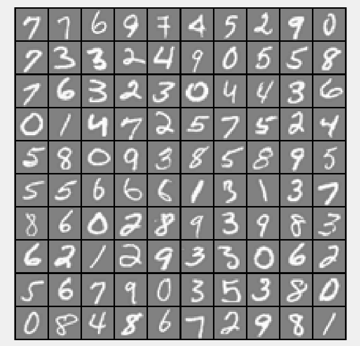

## Neural network handwritten digit classifier

This is a simple neural network digit classifier written as part of Coursera's Machine Learning class.

It has 97.5% accuracy in identifying single, handwritten digits from 0-9

 --> 3
